# MichelleLiang_T1A3

### Link to github: 

[Github Link](https://github.com/mcelle888/MichelleLiang_T1A3) 

### Code Style Guide: 

[Pep8 Guide Link](https://peps.python.org/pep-0008/#class-names) 

The source code was written using python and following PEP8 Styling Guide linked above. Some notable styling features followed include:

1. Four line indenting 
2. Adherance to naming conventions (e.g. CapWord for classes and exceptions, lowercase and underscores for functions and variables)
3. Self is first argument for instance methods
4. Line breaks occur before the binary operator for formulas
5. Modules all have lower case names with underscores used to improve readability in some cases
6. Inline comments avoided with block comments indented to the same level as code
7. Maximum line length of 79 characters  


### Features of the Application

#### Feature 1 : User's basic information
Allows the user to input some basic information about themselves and the wedding including their name, budget and date of wedding.


#### Feature 2: User input for different wedding vendors and reccomendations
Goes through a list of vendors for a wedding and asks the user if they have a chosen vendor or not. If they do, they are asked to enter the name and the cost. If not, they are provided with 3 reccommendations for each vendor with their respective costs and a short description. The user can pick one of these recommendations or they can choose to have the app randomly pick out of the three or finally they can choose to leave the vendor blank (in this case, an average cost will be used to calculate the final cost estimate). 

#### Feature 3: Scheduled to-do list
Creates a timestamped to-do list for the user to follow. This contains helps the user schedule important tasks by giving them an estimated deadline of when these tasks should be done relative to how many days left until their wedding date. 

#### Feature 4: Prints the final plan on a text editor for user to save/print
Creates a text file the user can save that contains all the information collected and processed. This includes the users basic information, vendor name and costs,  final cost estimations (which also tells them if they are over or under budget) and a scheduled to-do list of tasks to be completed before the big day!


### Help Documentation


#### App Installation Guide
#### 1. Open Terminal
In your terminal window, check that you have the correct version of python installed. You can do this by running:
```bash
python --version
```
If python version is not installed or you have a version below 3.10, the installation and update links can be found [here](https://www.python.org/downloads/) 

#### 2. Download Wedding App

Copy and paste the following to your terminal: 
```bash
git clone git@github.com:mcelle888/MichelleLiang_T1A3.git
```

The file can also be found from github [here](https://github.com/mcelle888/MichelleLiang_T1A3). 

#### 3. Open the application file that was cloned and cd into the src directory: 
```bash
cd MichelleLiang_T1A3/src
```

#### 4. Run the following executable command to open the application:
```bash
bash open_app.sh
```

Running the code below will:
1. Check again whether or not python is installed
2. Create and activate a virtual environment
3. Install all dependencies required for this app
4. Run the application file


#### Dependencies Required:

```python
pyfiglet == 1.0.2
emoji == 2.8.0
colorama == 0.4.6
pandas == 2.1.1 
pytest == 7.4.3
```


### Implementation Plan
[Link to Trello](https://trello.com/b/Znwe2osx/terminal-app)
#### Screenshots Day 1

Start of day 1

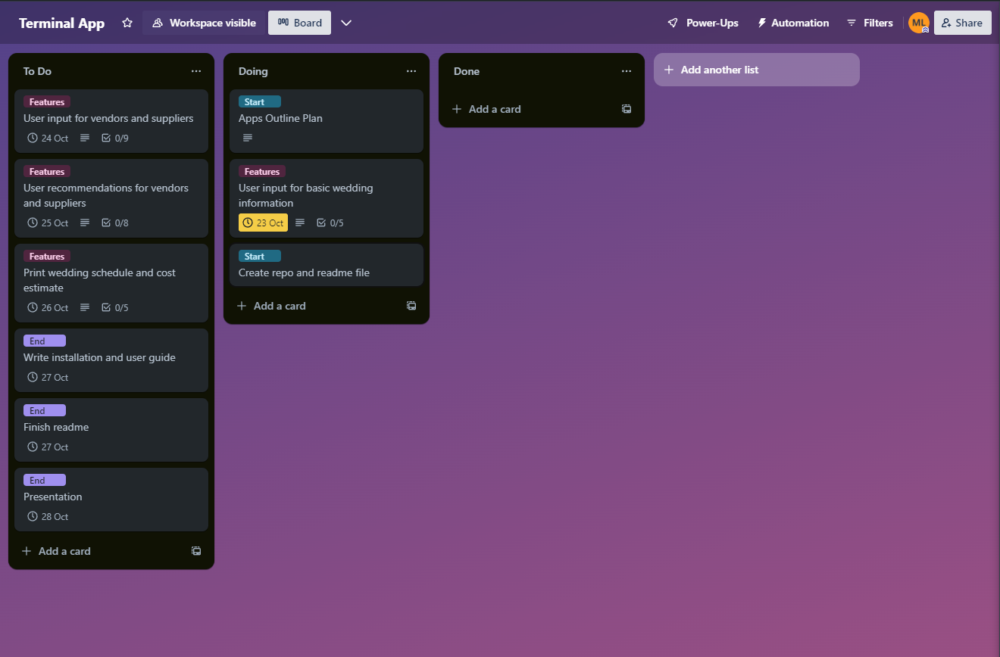

Feature 1 

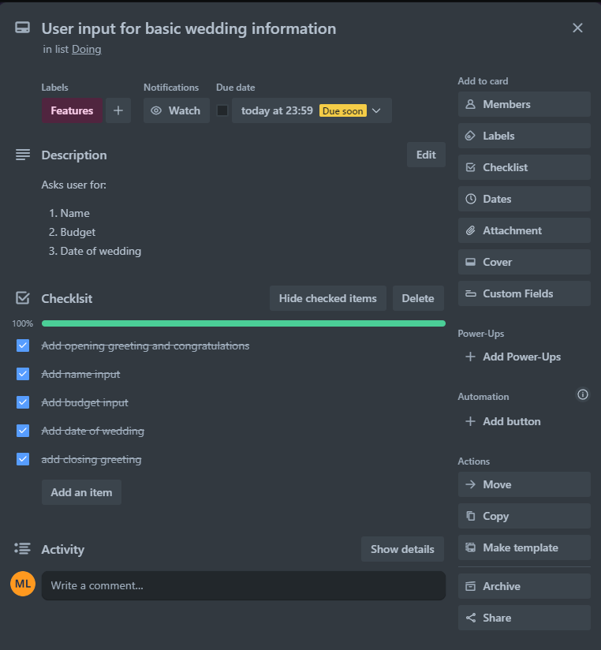

Feature 2

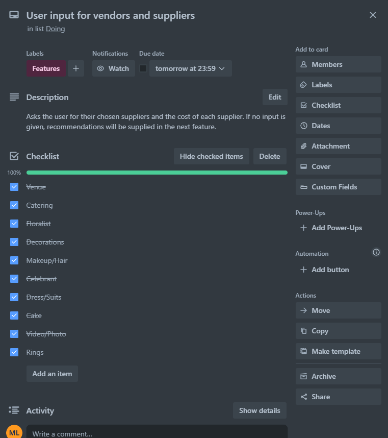

Feature 3

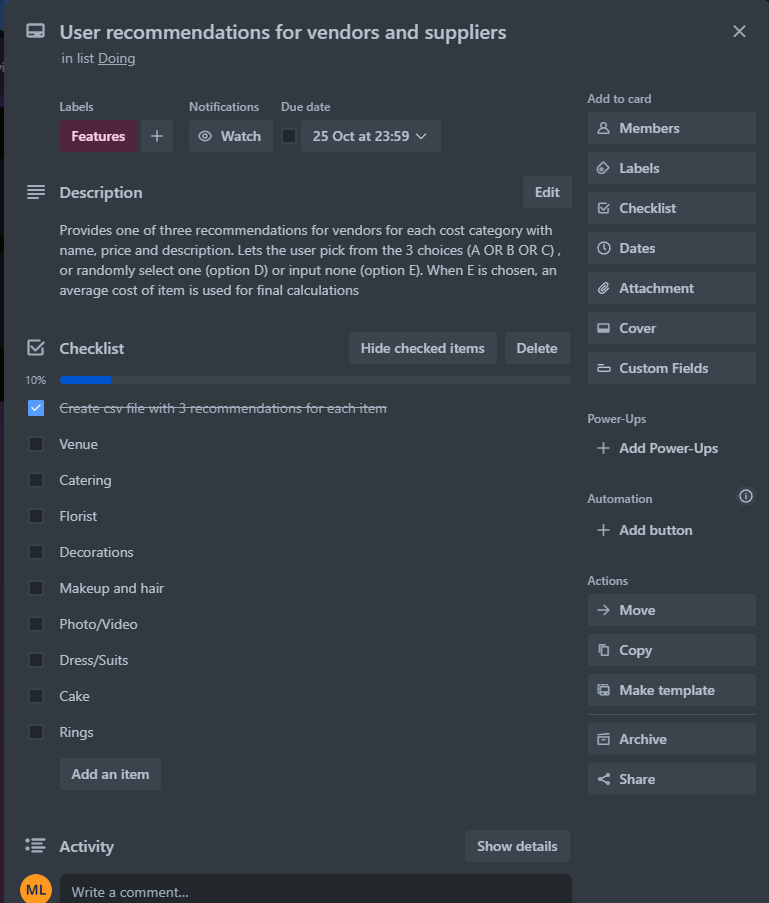


End of day 1
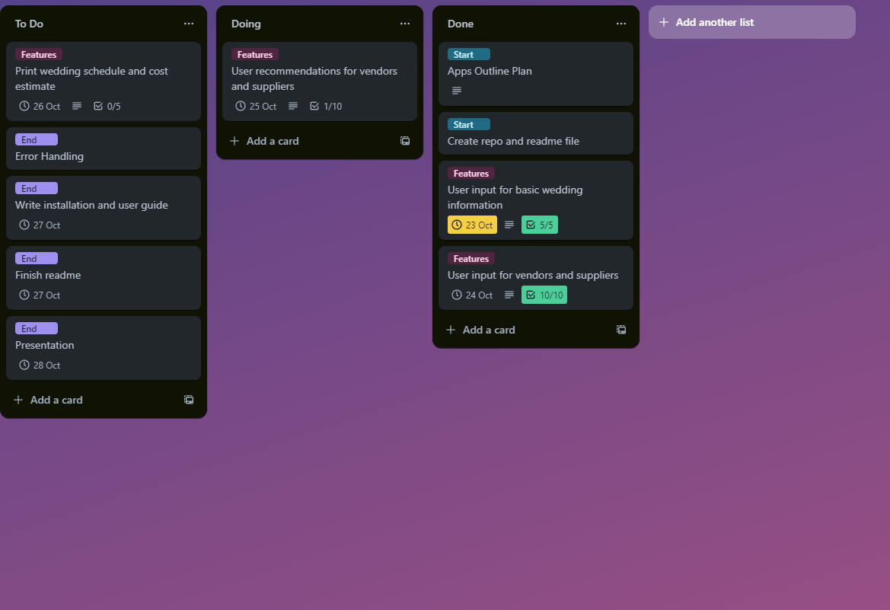


#### Screenshots Day 2
Feature 3

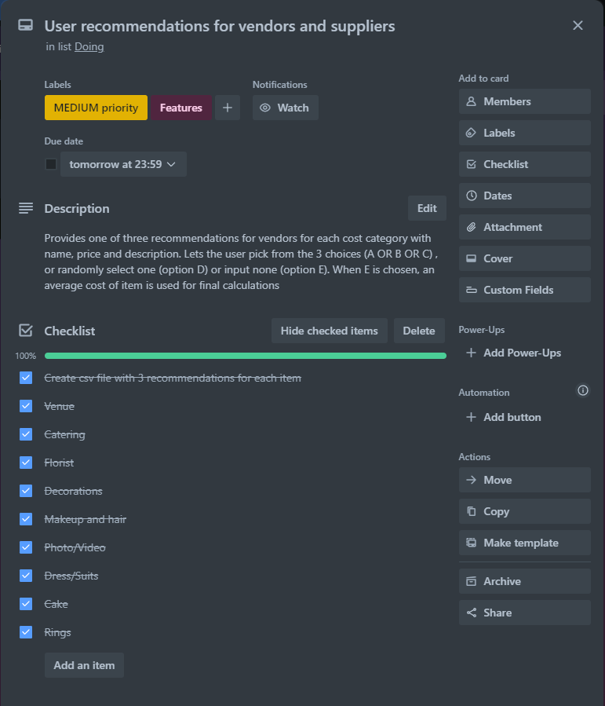

Feature 4

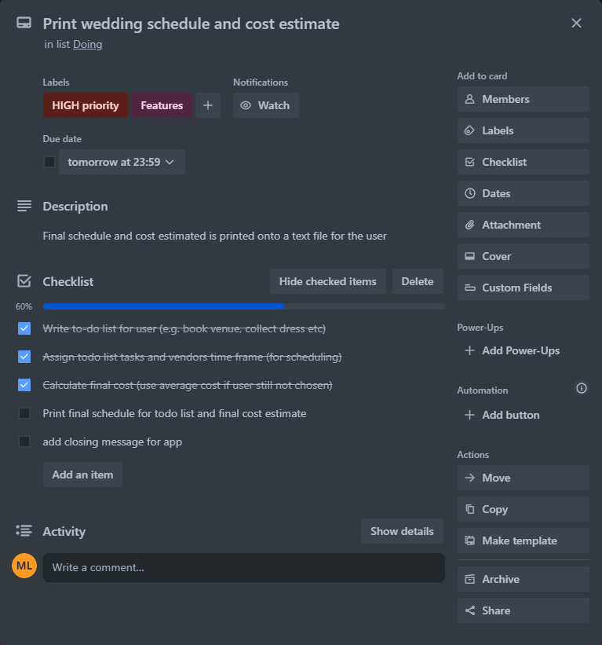

End of day 2

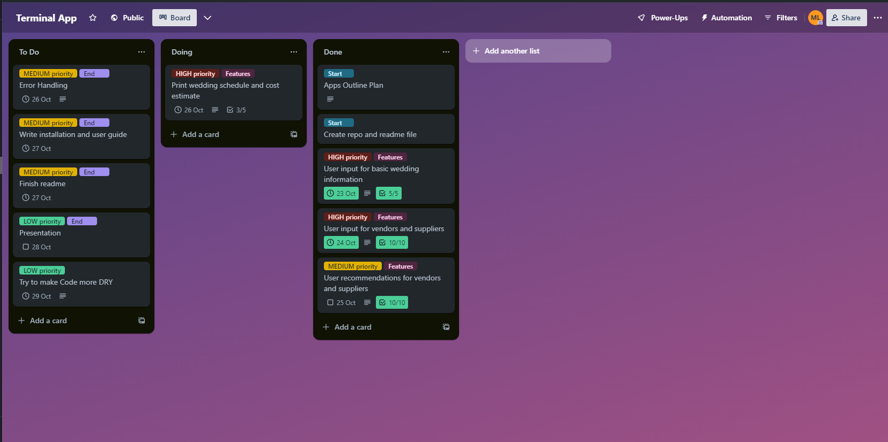


#### Screenshots Day 3
Feature 4

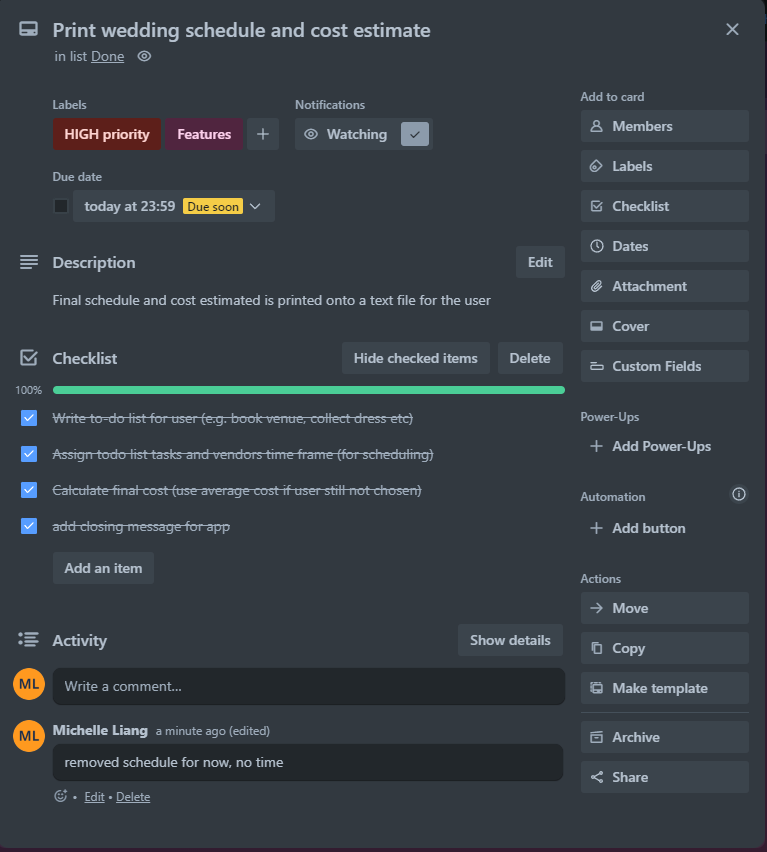


End of day 3


#### Screenshots Day 4

Error and Testing 

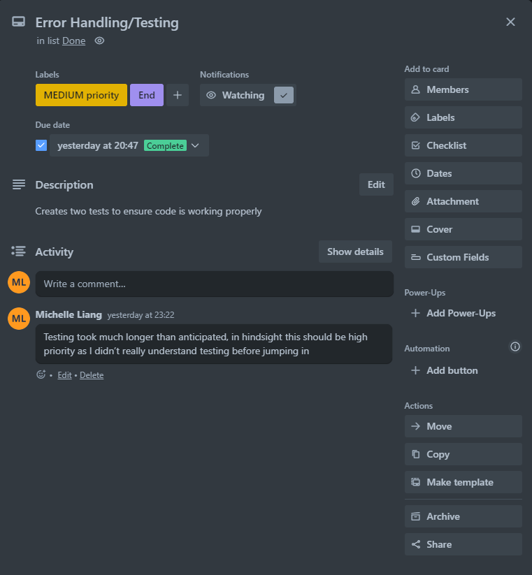

End of day 4

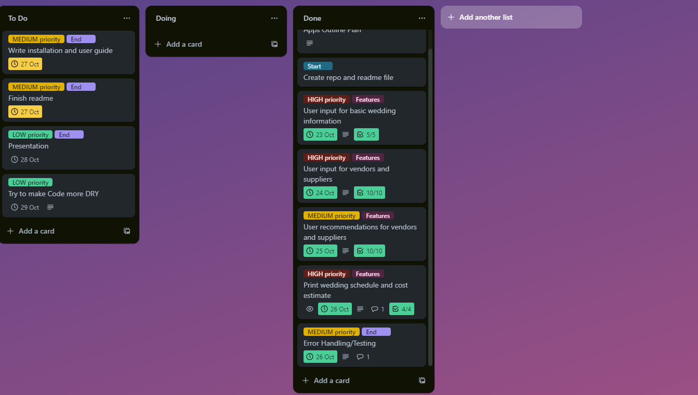

#### Screenshots Day 5

Feature 4

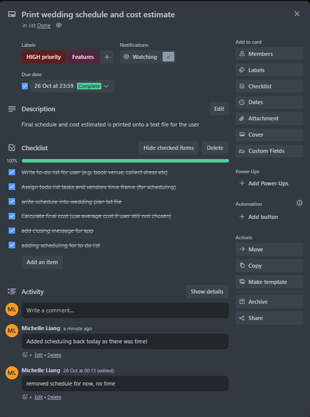

End of day 5

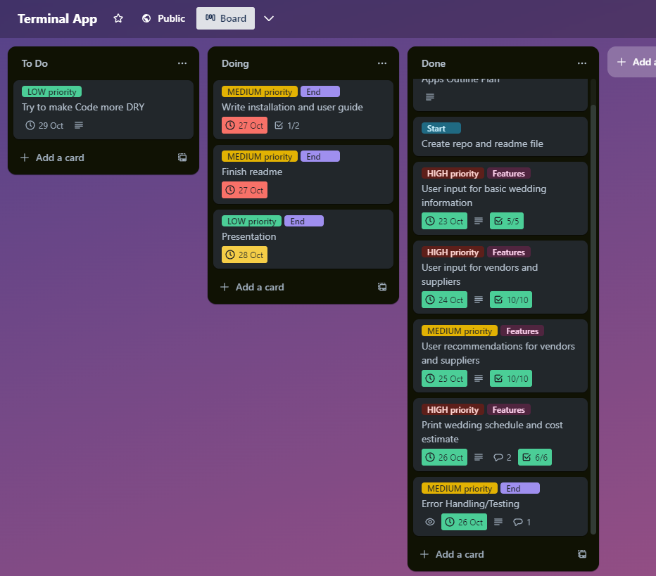


#### Screenshots Day 6

End of day 6

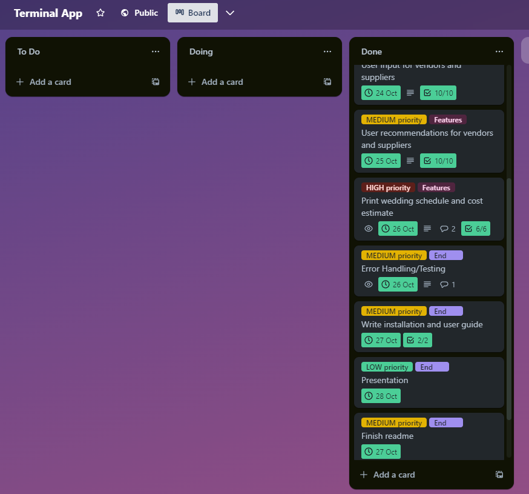


### References 

Hartley, J. colorama - PyPI. Available at: https://pypi.org/project/colorama/ 

Kim, T & Wurster, K.  emoji - PyPI. Available at: https://pypi.org/project/emoji/  

Pytest: helps you write better programs (no date) pytest. Available at: https://docs.pytest.org/en/7.4.x/ 

Rossum, G. van, Warsaw, B. and Coghlan, A. (no date) PEP 8 – Style Guide for Python Code. Available at: https://peps.python.org/pep-0008/   

Waller, P.  pyfiglet - PyPI. Available at: https://pypi.org/project/pyfiglet/ 
